# Proyecto Git Flow
Practica de Git Flow y Convetional Commits

# ¿Que es Git Flow?

Git Flow es una estrategia de ramificacion que permite organizar el desarrollo mediante ramas especificas para nuevas funcionalidades (feature), preparacion de versiones (release) y correcciones urgentes (hotfix)

## Creo la carpeta, documento .py dentro de ella y documento .md
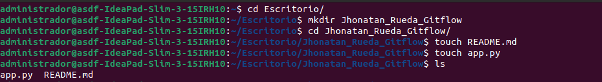

## Inicializo git y git flow 
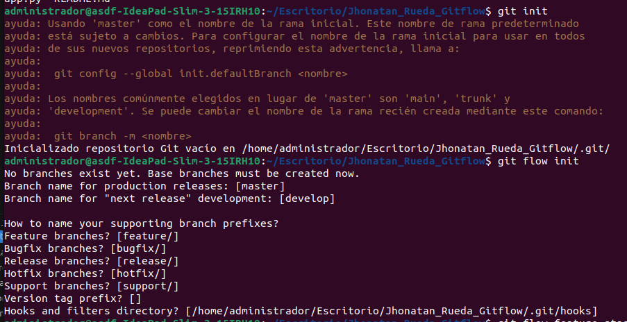

## Creo el primer commit 
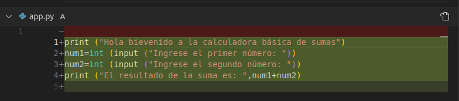

## Paso a feature
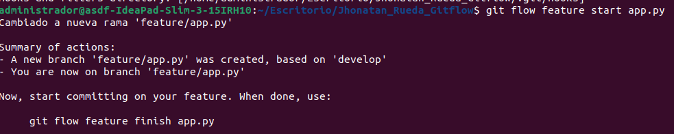

## primer commit en feature
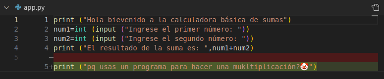
## segundo commit en feature 
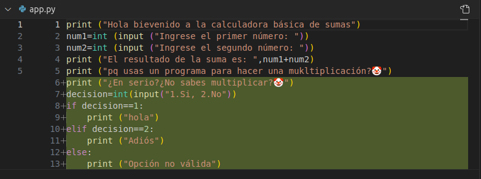
## Cerrar rama features 
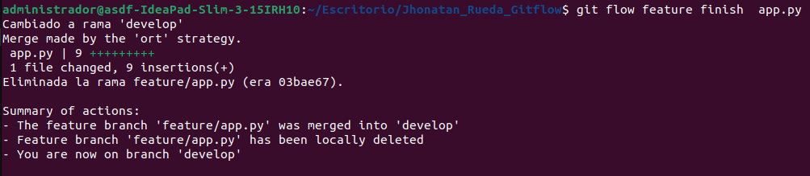

## inicialicé la rama RELEASE
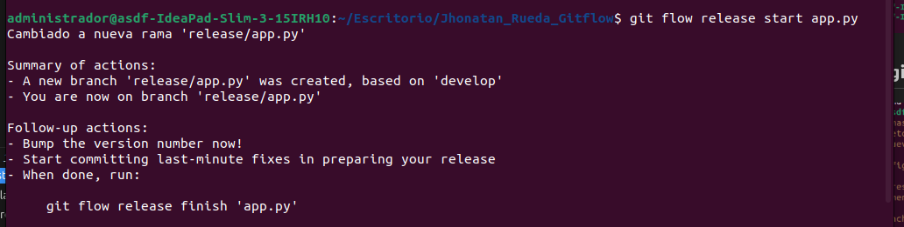
### Commit en rama release 
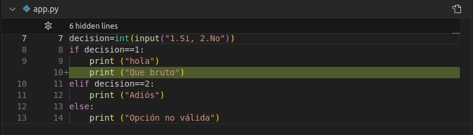
## Cierro rama RELEASE 
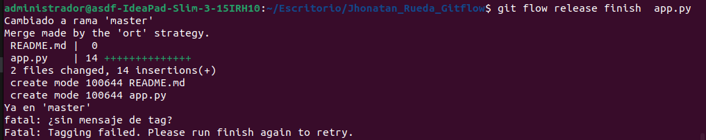

## Inicialicé rama hotfix 
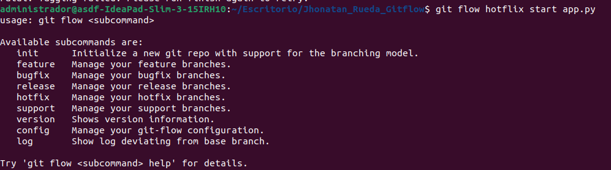
### Hice el commit en la rama hotfix 
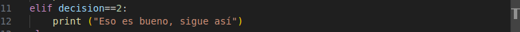
## Cierro rama Hotfix 
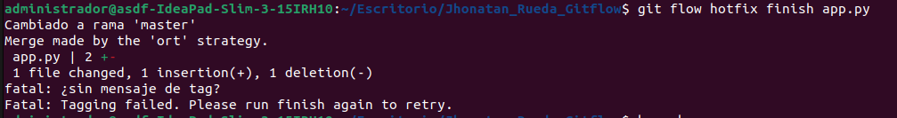

## Creo repositorio en git hub y lo subo
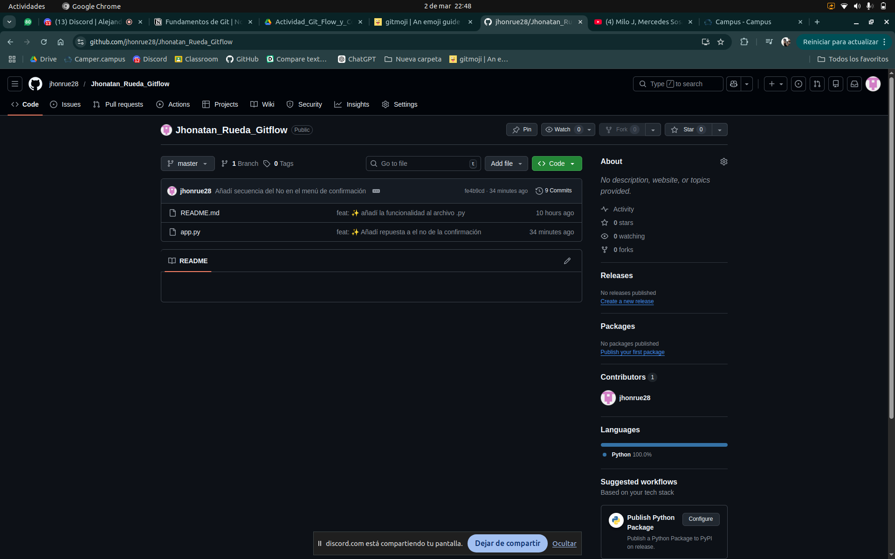

### Evidencia de git graph 
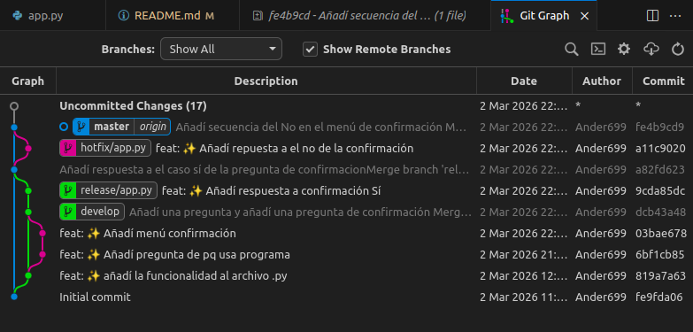
 
### Linea del tiempo en VS code 
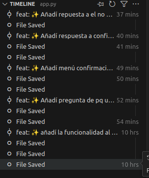
